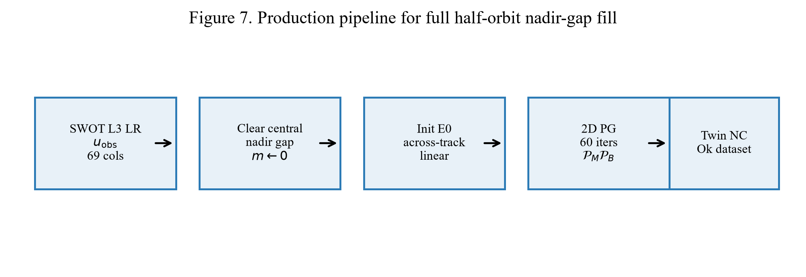

# On Nadir-Gap Filling for SWOT KaRIn SSHA

Supporting **GitHub mirror** for the technical report:

**[`OnNadirGapFilling.docx`](OnNadirGapFilling.docx)**

> Reconstruction of the SWOT KaRIn central nadir void with a **2D anisotropic Papoulis–Gerchberg** algorithm — theory, equations, Q1 figures, and **2024 production results** (`E:\SWOT2024` → `E:\SWOT2024_Ok`).

Scientific framing: **reconstruction with uncertainty** — not new KaRIn measurements in the gap.

---

## Report (primary artifact)

| File | Description |
|------|-------------|
| [`OnNadirGapFilling.docx`](OnNadirGapFilling.docx) | Full report (equations, tables, embedded figures) |
| [`REPORT.md`](REPORT.md) | GitHub-readable digest + figure gallery |

Source of truth in the parent workspace:

`../docs/OnNadirGapFilling.docx`

Refresh this mirror after regenerating the report:

```bat
scripts\sync_from_docs.bat
```

---

## Figures (Q1)

| Fig | File | Caption |
|-----|------|---------|
| 1 | [`figures/Fig01_swath_geometry.png`](figures/Fig01_swath_geometry.png) | KaRIn LR swath + nadir void |
| 2 | [`figures/Fig02_pg_iteration.png`](figures/Fig02_pg_iteration.png) | One Papoulis–Gerchberg iteration |
| 3 | [`figures/Fig03_spectral_mask.png`](figures/Fig03_spectral_mask.png) | Anisotropic spectral keep mask \(H(k)\) |
| 4 | [`figures/Fig04_before_after.png`](figures/Fig04_before_after.png) | Observed vs PG-filled SWOT crops |
| 5 | [`figures/Fig05_quality_distributions.png`](figures/Fig05_quality_distributions.png) | Quality scores (n=1000 crops) |
| 6 | [`figures/Fig06_production_2024.png`](figures/Fig06_production_2024.png) | 2024 full-orbit build outcomes |
| 7 | [`figures/Fig07_pipeline.png`](figures/Fig07_pipeline.png) | Production pipeline |

<p align="center">
  
</p>

---

## 2024 results (headline)

| Quantity | Value |
|----------|-------|
| Source | `E:\SWOT2024` (10,038 passes) |
| Output | `E:\SWOT2024_Ok` |
| Successfully filled | **9,532** (~95%) |
| Failed | 505 (HDF/I/O + too few known samples) |
| Method | `clear_central_nadir_gap` + `papoulis_gerchberg_2d_aniso` |
| Iterations \(T\) | 60 |
| Keep fractions | \(f_\parallel=0.35\), \(f_\perp=0.55\) |
| Crop quality (n=1000) | mean score **75.1**, median **77.9** (A:425, B:361, C:162, D:45, F:7) |

Machine-readable copies: [`results/`](results/).

---

## Theory (one-line core)

\[
v^{(t+1)}=\mathcal{P}_M\,\mathcal{P}_B\,v^{(t)},\quad
\mathcal{P}_B v=\mathcal{F}^{-1}(H\odot\mathcal{F}(v)),\quad
\mathcal{P}_M v=m\odot u_{\mathrm{obs}}+(1-m)\odot v
\]

Full derivation and method ranking: [`methods/METHODS_NADIR_GAP.md`](methods/METHODS_NADIR_GAP.md).

---

## Runnable sample (100 crops)

[`sample_100/`](sample_100/) holds the first 100 observed `ssha_filtered` crops (138 × 69, float32, NaN = missing). That is enough to rerun the fill without the SWOT pass archive.

Double-click [`Run_demo.bat`](Run_demo.bat) in this folder (or `scripts\run_demo.bat`). It opens a window: observed crop on the left, Papoulis–Gerchberg fill on the right. Up and Down move through the 100 crops.

```bat
Run_demo.bat
```

Needs Python 3 plus `numpy` and `Pillow`. The launcher installs those two packages if they are missing. Default settings match the 2024 production fill: \(T=60\), \(f_\parallel=0.35\), \(f_\perp=0.55\).

---

## Layout

```
GitHub_mirror/
├── Run_demo.bat              ← open the crop viewer
├── README.md                 ← this file
├── REPORT.md                 ← digest for web browsing
├── OnNadirGapFilling.docx    ← primary report
├── figures/                  ← Fig01–Fig07 (300 dpi PNG)
├── methods/                  ← method notes
├── results/                  ← summary JSON from 2024 build + quality audit
├── sample_100/               ← 100 observed 138×69 crops + demo panels
└── scripts/
    ├── run_demo.bat          ← same viewer launcher
    ├── nadir_viewer.py       ← the window
    ├── sync_from_docs.bat    ← refresh mirror from ../docs
    ├── build_OnNadirGapFilling_report.py
    ├── nadir_pg.py           ← crop PG fill
    ├── run_pg_demo.py        ← fill sample_100, write panels
    └── build_sample_100.py  ← rebuild crops from the parent workspace
```

The mirror stays small: the report, figures, summaries, and about 4 MB of float crops. Full SWOT passes and Ok trees stay outside this folder.

---

## Rebuild the Word report (optional)

From the parent `fill_nadir_gap` tree (needs local metrics + sample PNGs):

```bat
cd /d D:\RespondSeeSurface\fill_nadir_gap\docs
python build_OnNadirGapFilling_report.py
..\GitHub_mirror\scripts\sync_from_docs.bat
```

---

## Citation / use

If you use this material, cite the report title:

> *On Nadir-Gap Filling for SWOT KaRIn Sea-Surface Height Anomaly: Theory, Papoulis–Gerchberg Algorithm, and 2024 Production Results* — RespondSeeSurface / `fill_nadir_gap`.
