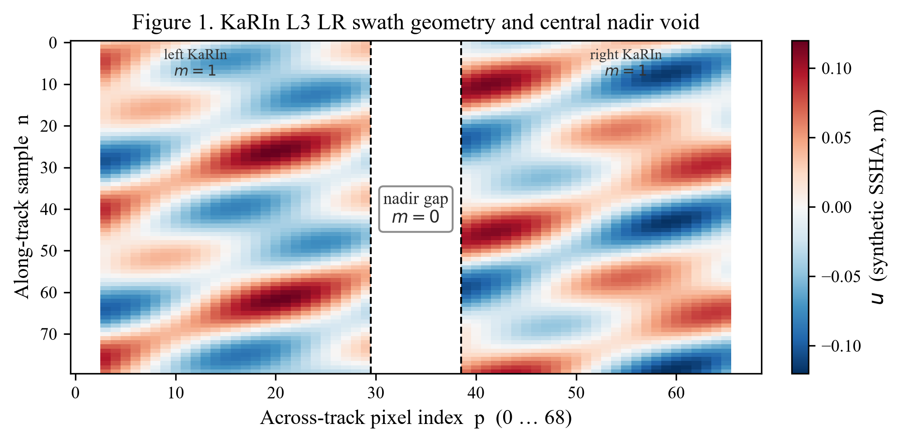
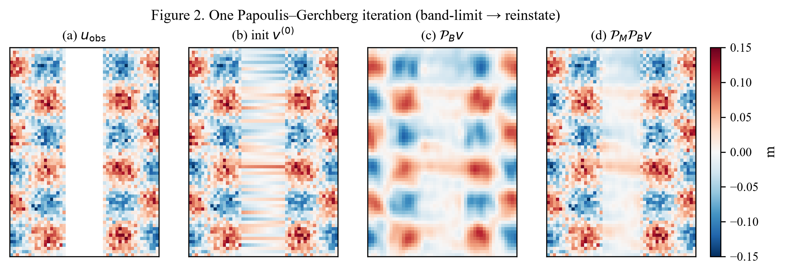
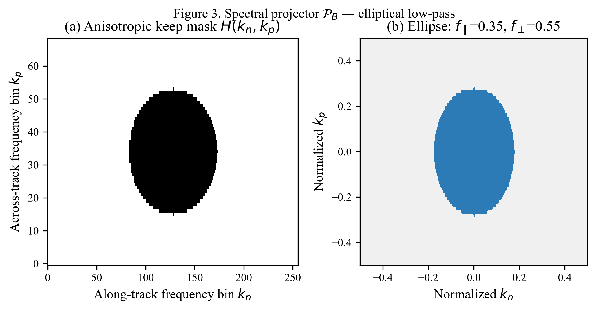
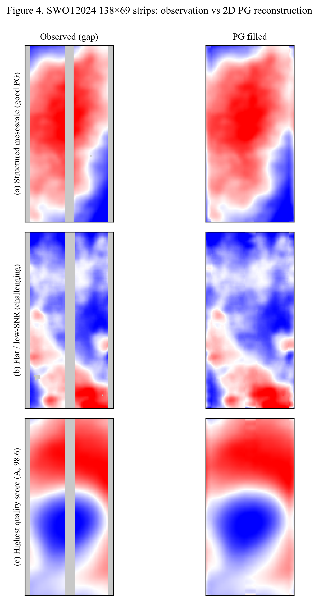
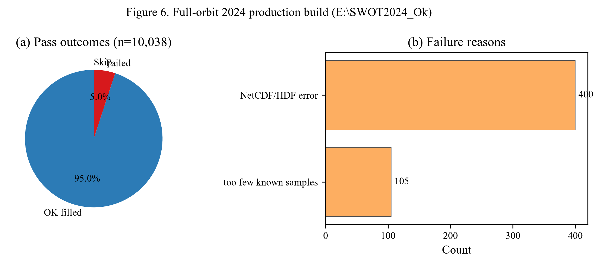
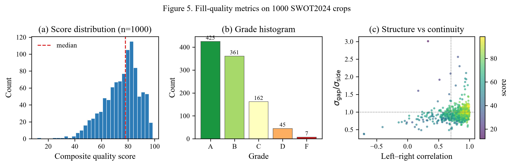

# Report digest — On Nadir-Gap Filling

Companion to [`OnNadirGapFilling.docx`](OnNadirGapFilling.docx).  
Open the `.docx` for numbered equations and full tables; this page is for quick GitHub browsing.

---

## Abstract

The SWOT KaRIn L3 LR swath (`ssha_filtered`, 69 across-track pixels) has a persistent **central nadir void**. We reconstruct that gap with a **2D anisotropic Papoulis–Gerchberg (PG)** iteration that (i) band-limits the complex Fourier transform with an elliptical keep mask \(H(k)\), and (ii) **reinstates every originally valid KaRIn sample exactly**. Magnitude-only FFT→IFFT is rejected because phase encodes spatial placement of eddy energy.

On **10,038** SWOT2024 half-orbits, **9,532** filled twins were written to `E:\SWOT2024_Ok` (~**95%** success). A 1,000-crop quality audit scores mean **75.1** (78.6% graded A or B). Framing throughout: reconstruction with uncertainty — not new KaRIn measurements.

---

## Pipeline

1. Decode `ssha_filtered`
2. Clear central nadir gap (drop secondary-instrument hits)
3. Initialize with across-track linear fill (E0)
4. Run 2D PG, \(T=60\), \(f_\parallel=0.35\), \(f_\perp=0.55\)
5. Write Ok twin NetCDF

---

## Geometry and algorithm

Core iteration:

\[
v^{(t+1)}=\mathcal{P}_M\,\mathcal{P}_B\,v^{(t)}
\]

\[
\mathcal{P}_B v=\mathcal{F}^{-1}\big(H\odot\mathcal{F}(v)\big),\qquad
\mathcal{P}_M v=m\odot u_{\mathrm{obs}}+(1-m)\odot v
\]

Elliptical keep mask (production):

\[
H(k_n,k_p)=1 \iff \Big(\frac{k_n-c_n}{r_n}\Big)^2+\Big(\frac{k_p-c_p}{r_p}\Big)^2\le 1
\]

---

## Qualitative examples

- **(a)** Structured mesoscale — PG continues coherent blobs across the void  
- **(b)** Flat / low-SNR — fixed keep mask can invent gap variance (ringing)  
- **(c)** Highest crop quality score in the audit (A, 98.6)

---

## 2024 production

| Quantity | Value |
|----------|-------|
| Source passes | 10,038 |
| Newly filled OK | 9,532 |
| Skip | 1 |
| Failed | 505 |
| Success rate | 94.97% |
| Wall time | ~3.14 h (4 workers) |
| Failures | NetCDF/HDF 400; too few known samples 105 |

JSON: [`results/summary_2024.json`](results/summary_2024.json), [`results/COMPLETION_REPORT.json`](results/COMPLETION_REPORT.json).

---

## Crop quality (n = 1,000)

| Metric | Value |
|--------|-------|
| Mean / median score | 75.13 / 77.94 |
| P10 / P90 | 56.43 / 91.22 |
| Grades A–F | 425 / 361 / 162 / 45 / 7 |
| Top flags | ringing 591; weak L–R 353; flat 40; invent 25 |

JSON: [`results/fill_quality_summary.json`](results/fill_quality_summary.json).

Gap-surgery skill (PoC batch): PG beats linear only ~half the time (mean skill MAE slightly negative) → motivates hybrid AI + spectral guard (E2\*).

---

## Method ranking (short)

| ID | Method | Role |
|----|--------|------|
| E0 | Across-track linear | Baseline / PG init |
| E1 | 2D anisotropic PG | **Production 2024** |
| E2\* | Spatial residual AI + \(H(k)\) + reinstate | Recommended next |
| — | Magnitude-only FFT→IFFT | Avoid |

See [`methods/METHODS_NADIR_GAP.md`](methods/METHODS_NADIR_GAP.md).

---

## What this mirror excludes

- Raw SWOT NetCDF (`E:\SWOT2024`, `E:\SWOT2024_Ok`)
- 1000-crop PNG libraries (`test_69x138`, `filled_69x138*`)
- Full quality CSVs / training checkpoints

Parent project: `RespondSeeSurface/fill_nadir_gap`.
